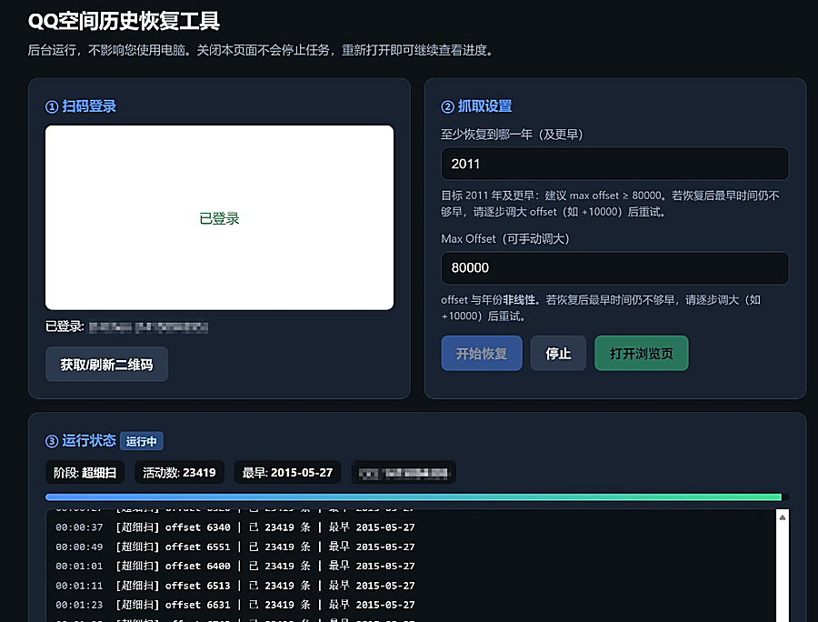
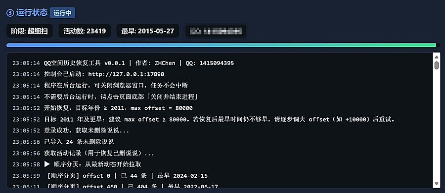
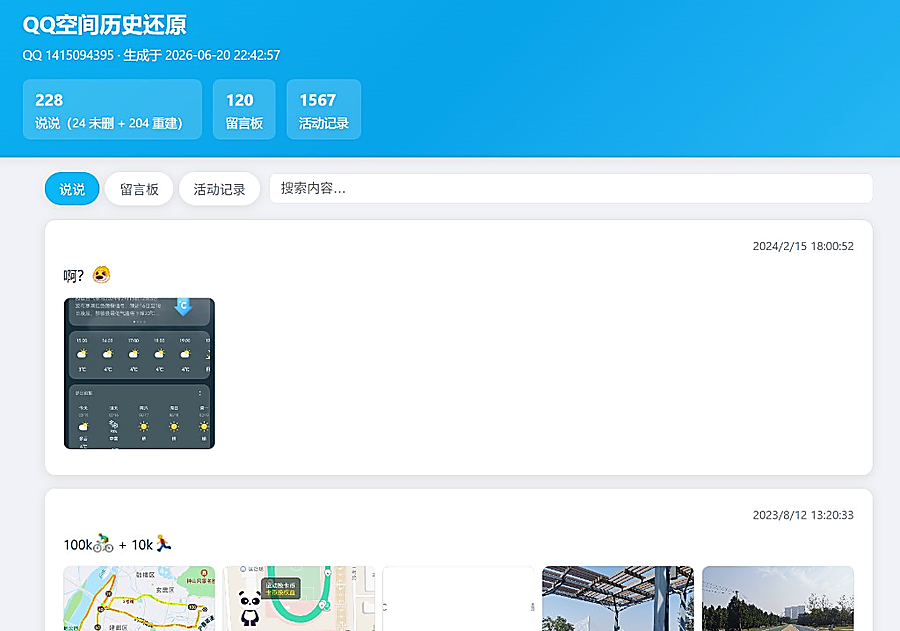

# QQ Zone History Recovery Tool (qzone-history)

> **🌐 语言 / Language / Langue：** [简体中文](README.md) · [**English**](README.en.md) · [Français](README.fr.md)

[](version/version.go)
[](LICENSE)
[](https://go.dev/)
[](#build-from-source)
[](https://github.com/ZHChen2000/qzone-history)

**Author: [ZHChen](https://github.com/ZHChen2000)** · **Contact: QQ 1415094395**

Recover **deleted posts and messages** from QQ Zone “Activity” feeds, post APIs, and message-board APIs, then export them as local JSON and HTML viewer pages.

> For personal backup of **your own** QQ Zone data only. Please comply with Tencent’s terms of service.

---

## Screenshots

After double-clicking `qzone-history-gui.exe`, your browser opens the Web console. Scan the QR code to sign in and start recovery:



Live logs and fetch progress:



When finished, browse posts, messages, and activity records on a local HTML timeline:



---

## Features

- QQ QR-code sign-in (official login flow; cookies stored locally only)
- Web console: live logs, progress, stop / exit
- Recommended Max Offset by target year; manual deep-scan tuning
- Recover undeleted posts; rebuild deleted posts from activity records
- Message-board API fetch; fallback rebuild from activity records
- Export `{QQ}_export.json`, `{QQ}_activities.json`, `{QQ}_view.html`

## Quick start

**Don’t want to compile?** Double-click `qzone-history-gui.exe` in this folder and follow [quickStart.md](./quickStart.md).

For detailed steps, Offset table, time estimates, and FAQ → **[quickStart.md](./quickStart.md)** (Chinese)

## Project layout

```
qzone-history/
├── qzone-history-gui.exe   # Windows prebuilt (no console window)
├── docs/images/            # README screenshots
├── cmd/                    # Entry points and debug tools
├── internal/               # Business logic, GUI, API client
├── pkg/                    # Export, paths, logging, etc.
├── config/                 # Default configuration
├── version/                # Version and author info
├── go.mod
├── README.md
└── quickStart.md
```

## Build from source

Requires [Go 1.21+](https://go.dev/dl/).

```powershell
# No console window (recommended for distribution)
go build -ldflags="-H windowsgui" -o qzone-history-gui.exe ./cmd/main.go

# With console (for debugging)
go build -o qzone-history.exe ./cmd/main.go
```

## Technical notes

This tool is **not** an official Tencent Open Platform API. It simulates browser access to QQ Zone web internal endpoints (similar to opening your zone in a browser). Requests use login cookies and browser-like headers, with rate limiting during fetching.

- Data is **stored on your machine only**; nothing is uploaded to third-party servers
- Deep scans (large Offset) generate many requests—set parameters carefully and use at your own risk

## License

This project is licensed under the [Apache License 2.0](LICENSE).

## Disclaimer

This tool is for learning and personal data backup only. Do not use it to access others’ spaces without authorization, for commercial scraping, or for any illegal purpose. You are solely responsible for any consequences of using this tool.
